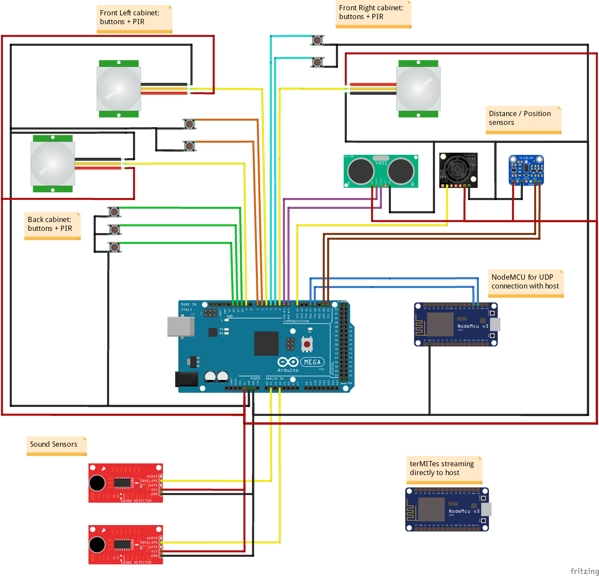

# Piccolo Kitchen- Sensors
Here we include the first codes related to data gathering from the sensors deployed on the [Piccolo Kitchen Project](https://www.media.mit.edu/projects/piccolo-kitchen/overview/). The project consists of a transformable kitchen, using architectural robotics for a hyper-efficent use of space. In a built prototype we include a wide range of sensors aiming to detect activity and study behavior in a new transformable enviroment.

More info: https://www.media.mit.edu/projects/piccolo-kitchen/overview/

The different folders contain the codes that should be in the different parts: the Arduino board, the NodeMCU and the host computer.
The folder *data*  contains samble data recorded from different tests.

At the moment the sensors we are using include: (*plus some sensors on their way!, included in the arduino total code*)

   - Ultrasonic Sensor Y401
   - *Matbotix Ultrasonic range finder EZ*
   - VL53L0X distance_sonic sensor
   - Sound sensor SEN-12642 x2
   - PIR sensor x1 *x3*
   - Buttons x5 ( 3 backside,2 upper cabinet left) *+ upper cabinet right*
   - terMITes x1 (Measuring Temperature, Humidity and Light)
   
   The arduino code is set to gather the data from the sensors, preprocess it and communicate over serial with a NodeMCU. Then, through UDP communication the data is shared with a computer.
      
   In the host omputer, coded in python, the UDP package are received, the data saved into csv format to be used for future analysis and visualisation.
   
   More info about the visualisation here: [HomaData Visuals](https://github.com/agarciagoni/HomeData-Visuals)
   
   As more sensors and documentation included, the codes will be updated!
   

   
   

